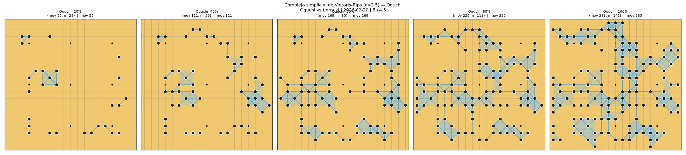
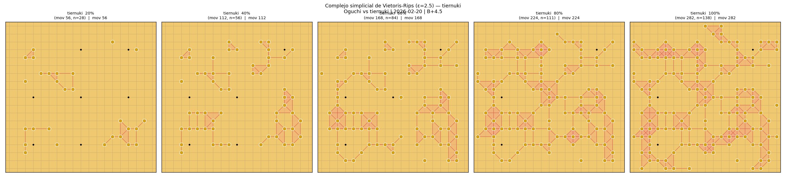
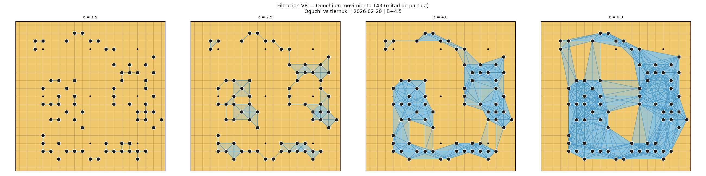
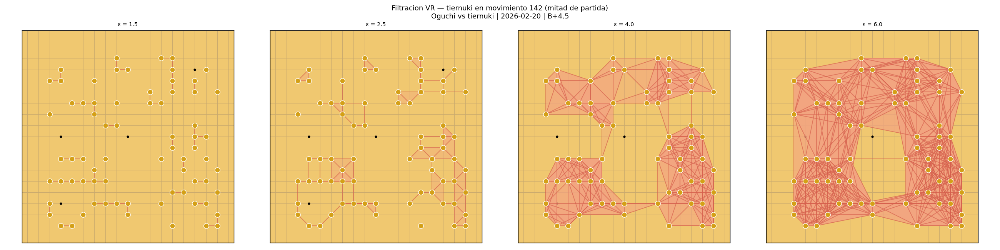
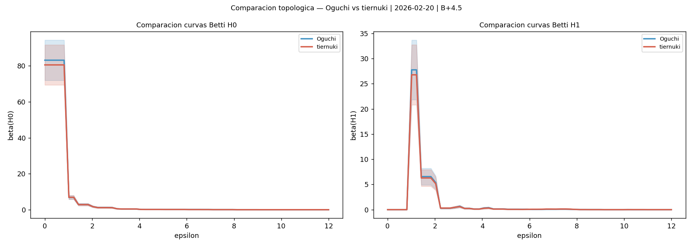

# Análisis Topológico del Go

> **¿Qué tan diferente es el juego de dos jugadores de Go, matemáticamente?**
> Este proyecto responde esa pregunta usando *homología persistente* — una rama de la topología algebraica que detecta "forma" en datos.

---

## Tabla de contenidos

1. [Qué analiza y qué ve el sistema](#qué-analiza-y-qué-ve-el-sistema)
2. [La idea en términos de Go](#la-idea-en-términos-de-go)
3. [Cómo funciona el sistema](#cómo-funciona-el-sistema)
4. [Candela: el extractor de patrones](#candela-el-extractor-de-patrones)
5. [La capa de análisis topológico](#la-capa-de-análisis-topológico)
6. [Dos partidas, dos tipos de juego](#dos-partidas-dos-tipos-de-juego)
   - [Oguchi vs tiernuki — estilos topológicamente convergentes](#oguchi-vs-tiernuki--estilos-topológicamente-convergentes)
   - [ometitlan vs haya371203 — mayor variedad topológica entre jugadores](#ometitlan-vs-haya371203--mayor-variedad-topológica-entre-jugadores)
   - [Comparación directa](#comparación-directa)
7. [Cómo correr tu propio análisis](#cómo-correr-tu-propio-análisis)
8. [Dependencias](#dependencias)
9. [Créditos](#créditos)

---

## Qué analiza y qué ve el sistema

### El punto de partida: una partida de Go en formato SGF

El sistema recibe un archivo SGF — el registro completo de una partida, jugada por jugada. De ahí extrae dos cosas: quién jugó cada piedra y cómo estaba el tablero en ese momento.

---

### Paso 1 — Candela convierte cada jugada en un patrón

Por cada jugada, Candela toma una foto del tablero completo (19×19) centrada en donde se acaba de jugar. Esa foto se **canonicaliza**: se aplican rotaciones, reflexiones e inversiones de color hasta encontrar la representación mínima. El mismo joseki jugado en cualquier esquina del tablero, con cualquier color, queda representado como el mismo objeto matemático.

Cada jugada se convierte en un **patrón** — una tupla 19×19 de símbolos que describe la posición global del tablero en ese momento.

---

### Paso 2 — El patrón se convierte en geometría

El sistema toma las piedras de **un solo jugador** en un momento dado y las trata como una nube de puntos en el tablero (coordenadas fila-columna de cada piedra). Sobre esa nube construye el **complejo de Vietoris-Rips**:

- ε = 1 → conecta solo piedras adyacentes (grupos con libertades compartidas)
- ε = 2.5 → conecta piedras a distancia Manhattan ≤ 2 (influencia local)
- ε = 6 → captura relaciones entre grupos distantes (estrategia global)

Se usa **distancia Manhattan** porque el tablero de Go es una cuadrícula ortogonal.

---

### Paso 3 — Homología persistente: qué "forma" tienen las piedras

En lugar de calcular el complejo a una sola escala, el sistema barre ε de 0 a 12 y registra cuándo aparece y desaparece cada estructura topológica:

**H₀ — grupos de piedras:**
Cada componente conexa del complejo es un grupo de piedras. Cuando dos grupos se fusionan al aumentar ε, el más joven "muere". El diagrama de persistencia H₀ muestra cuántos grupos hubo y cuánto tiempo sobrevivieron.

**H₁ — lazos / ojos / cercados:**
Un lazo topológico aparece cuando un conjunto de piedras encierra una región — el análogo matemático de un ojo o territorio cerrado. El diagrama de persistencia H₁ muestra cuántos lazos existieron, a qué escala nacieron y cuándo desaparecieron. Los más persistentes (lejos de la diagonal del diagrama) son los más significativos.

La **entropía persistente** resume esa información en un solo número: qué tan compleja es la configuración topológica del jugador en ese momento.

---

### Paso 4 — Cohomología: quién sostiene cada lazo

La cohomología es la dualización algebraica de la homología. Mientras la homología dice *que existe* un lazo, la cohomología dice *qué pares de piedras específicos lo sostienen*.

El sistema calcula el **cociclo representativo** de cada lazo H₁: un conjunto de aristas (pares de piedras) que forman la columna vertebral de ese territorio.

El **cup product** φ₁∪φ₂ entre dos cociclos detecta si dos lazos interactúan generando una clase H₂. En Go, un cup product no trivial es la firma algebraica de un **grupo con dos ojos** — vivo incondicionalmente.

---

### Paso 5 — El espacio topológico del jugador

Cada jugada queda representada como un vector de 361 dimensiones. El sistema calcula las distancias entre todos los vectores y los proyecta en 2D con MDS. El resultado es el **espacio topológico del jugador**: un mapa donde cada punto es una jugada y los puntos cercanos son jugadas con posiciones similares. La trayectoria muestra cómo evoluciona el estilo del jugador a lo largo de la partida.

---

### Paso 6 — Estadística: ¿las diferencias son reales?

- **Test de permutación (999 iteraciones):** ¿la diferencia topológica entre dos grupos es mayor de la esperada por azar?
- **Bootstrap de Betti (400 remuestras):** bandas de confianza al 95% sobre las curvas de Betti — qué tan consistente es el estilo del jugador
- **SVM:** clasifica jugadas (apertura vs final, negro vs blanco) usando imágenes de persistencia H₁ — la accuracy mide qué tan distinguibles son topológicamente esos grupos

---

### Lo que el sistema ve en cada partida

| Lo que se observa | Lo que significa en Go |
|-------------------|------------------------|
| H₀ entropía alta | Muchos grupos variados — juego disperso, influencia global |
| H₀ entropía baja | Pocos grupos bien definidos — juego local, territorial |
| H₁ entropía alta | Muchos ojos/cercados de distintos tamaños — posición compleja |
| H₁ entropía baja | Pocos lazos o ninguno — posición abierta, sin territorios cerrados |
| Lazo H₁ muy persistente | Territorio que se mantiene estable en un rango amplio de escala |
| Cup product ≠ 0 | Dos lazos que interactúan — grupo con dos ojos |
| p-valor alto (N vs B) | Ambos jugadores construyen el tablero con la misma lógica topológica |
| SVM ~97% (apertura vs final) | La topología de apertura y final son tan distintas que se separan casi sin error |
| Trayectoria MDS compacta | Jugador consistente — siempre juega posiciones topológicamente similares |
| Trayectoria MDS dispersa | Alta variedad táctica — el jugador cambia de tipo de posición frecuentemente |

### Lo que el sistema NO ve

- El resultado de capturas individuales
- El orden local de las jugadas (táctica inmediata)
- Quién va ganando en puntos
- La calidad de cada jugada individual

El sistema ve la **forma global** de cómo cada jugador ocupa el tablero — la arquitectura topológica de su juego — y cómo esa arquitectura evoluciona y se compara entre jugadores.

---

## La idea en términos de Go

Cada vez que un jugador hace una jugada, las piedras en el tablero forman una **configuración espacial**: grupos separados, cadenas conectadas, cercados, ojos. Esa configuración tiene una *forma* matemática que puede medirse con herramientas topológicas:

- **H₀ (componentes conexas):** ¿cuántos grupos de piedras independientes tiene el jugador?
- **H₁ (lazos / ojos):** ¿cuántos ojos o cercados territoriales ha formado?

Al calcular estas medidas para cada jugada y a lo largo de toda la partida, podemos construir un **espacio topológico del jugador** — una representación de cómo evoluciona su estilo de juego desde la apertura hasta el final.

Con eso podemos preguntar:
- ¿Los dos jugadores forman patrones topológicamente distintos, o son indistinguibles?
- ¿El estilo de un jugador cambia significativamente entre la apertura y el final?
- ¿Existen "clusters" de jugadas — momentos con estilos similares?

---

## Cómo funciona el sistema

```
Archivo SGF (partida de Go)
        │
        ▼
  ┌─────────────┐
  │   CANDELA   │  ← extrae y canonicaliza patrones 19×19
  └─────────────┘
        │  Pattern = tuple[tuple[str,...],...]  (19×19)
        │  Símbolos: 'b' piedra negra, 'w' piedra blanca,
        │            '+' vacío interior, '/' borde, '.' fuera
        ▼
  ┌──────────────────────────────────────────────┐
  │           CAPA TDA (candela_tda/)            │
  │                                              │
  │  representation.py → nube de puntos          │
  │  complex.py        → complejo de Vietoris-Rips│
  │  persistence.py    → H₀, H₁, entropía        │
  │  distances.py      → distancias entre patrones│
  │  stats.py          → tests estadísticos       │
  │  viz.py            → figuras                  │
  │  report.py         → reporte Markdown         │
  └──────────────────────────────────────────────┘
        │
        ▼
  Figuras + Reporte con interpretación narrativa
```

---

## Candela: el extractor de patrones

**[Candela](https://github.com/angelsesma/candela)** es el proyecto base de este sistema. Fue desarrollado originalmente para construir una base de datos de patrones de Go a partir de archivos SGF.

### Qué tipo de patrones produce Candela

La referencia clásica en análisis de patrones de Go (Liu y Dou, 2007) extraía ventanas de **5×5** centradas en cada jugada — suficiente para capturar contactos locales como atari, hane o tsuke, lo que el paper llama "átomos" del juego.

Candela amplía eso a **19×19**: el tablero completo centrado en la jugada. Esto cambia cualitativamente lo que se captura:

- Una ventana 5×5 ve el contacto inmediato: si hay una piedra adyacente, si hay capturas posibles
- Una ventana 19×19 ve la **posición global**: cuántos grupos tiene el jugador, qué tan separados están, qué territorios están delimitados, qué influencia tiene en el centro

En términos del paper, se pasa de "átomos" (táctica local) a "moléculas" (estructura estratégica global). Es esta visión completa del tablero la que hace posible medir topología significativa: no tiene sentido hablar de grupos conectados o cercados si solo se mira un cuadrado de 5 intersecciones.

### Qué hace Candela con cada jugada

Por cada jugada de la partida, Candela:

1. **Reproduce el tablero** jugada a jugada usando `sgfmill`
2. **Extrae una ventana 19×19** centrada en la última jugada
3. **Canonicaliza el patrón**: aplica las 16 transformaciones posibles del tablero (4 rotaciones × 2 reflejos × 2 inversiones de color negro↔blanco) y se queda con el **mínimo lexicográfico**

La canonicalización hace que el mismo joseki jugado en cualquier esquina del tablero, con cualquier color, sea **el mismo objeto matemático**. Esto permite comparar patrones entre jugadores de forma justa.

Sin Candela, no tendríamos una representación estructurada y comparable de las posiciones del tablero. La canonicalización garantiza que la topología que detectamos refleja la **geometría real del juego**, no artefactos de orientación o color.

---

## La capa de análisis topológico

Los módulos en `candela_tda/` toman los patrones de Candela y aplican análisis topológico:

| Módulo | Qué hace |
|--------|----------|
| `representation.py` | Convierte Pattern → nube de puntos `(row,col)`, vector de 361 dims, o grafo |
| `complex.py` | Construye el complejo de Vietoris-Rips con **distancia Manhattan** |
| `persistence.py` | Calcula H₀, H₁, entropía persistente, curvas de Betti, imágenes de persistencia |
| `distances.py` | Distancias entre diagramas: Bottleneck, Wasserstein, Landscape L² |
| `stats.py` | Tests de permutación, clustering, clasificadores SVM con validación cruzada |
| `viz.py` | Complejo simplicial sobre el tablero, espacio topológico MDS |
| `report.py` | Reporte Markdown con interpretación narrativa automática |

> **Nota sobre la distancia:** Usamos **distancia Manhattan** (|Δfila| + |Δcol|) para construir el complejo VR. Con ε=1, Manhattan captura exactamente las piedras con libertades compartidas — más fiel a la estructura del tablero de Go que la distancia euclidiana.

---

## Dos partidas, dos tipos de juego

El sistema revela diferencias cualitativas entre partidas. Analizamos dos partidas reales de OGS que ilustran dos situaciones distintas: una donde ambos jugadores convergen en el mismo estilo topológico, y otra donde existe mayor variedad entre ellos.

---

### Oguchi vs tiernuki — estilos topológicamente convergentes

**OGS · 2026-02-20 · 283 movimientos · B+4.5**
Resultados completos: [`ejemplo_oguchi_vs_tiernuki/`](ejemplo_oguchi_vs_tiernuki/)

En esta partida, el análisis topológico muestra que ambos jugadores construyen patrones estructuralmente muy similares a lo largo de toda la partida. El test de permutación entre los estilos de Negro y Blanco arroja **p = 0.908** — prácticamente en el centro de la distribución nula, lo que indica que sus distribuciones topológicas son casi indistinguibles.

Esto se refleja también en las métricas de entropía:

| Descriptor | Oguchi (N) | tiernuki (B) |
|------------|-----------|--------------|
| H₀ entropía media | 3.998 | 3.972 |
| H₁ entropía media | 2.978 | 2.954 |

Los valores son prácticamente idénticos: ambos jugadores forman grupos de piedras con la misma complejidad y el mismo número de lazos topológicos a lo largo del juego.

#### Complejos simpliciales en 5 momentos del partido

| Negro (Oguchi) | Blanco (tiernuki) |
|:--------------:|:-----------------:|
|  |  |

Ambos complejos evolucionan con estructura similar: densidad de triángulos comparable, distribución espacial parecida.

#### Filtración de Vietoris-Rips (a cuatro escalas ε)

| Negro | Blanco |
|:-----:|:------:|
|  |  |

#### Espacio topológico (trayectoria MDS de cada jugador)


#### Evolución de la entropía por jugador


#### Comparación de curvas de Betti



Las curvas de Betti de ambos jugadores se solapan casi perfectamente — confirmación visual de la convergencia topológica.

#### Resultados estadísticos

| Pregunta | p-valor | Conclusión |
|----------|---------|------------|
| ¿Son topológicamente distintos Oguchi y tiernuki? | **0.908** | No — estilos casi idénticos |
| ¿Cambia el estilo de Oguchi entre apertura y final? | 0.001 | Sí — muy significativo |
| ¿Cambia el estilo de tiernuki entre apertura y final? | 0.001 | Sí — muy significativo |
| SVM apertura vs final — Oguchi (H₁) | — | **97.2% accuracy** |
| SVM apertura vs final — tiernuki (H₁) | — | **96.5% accuracy** |

Ver el [reporte completo](ejemplo_oguchi_vs_tiernuki/reporte_oguchi_vs_tiernuki.md).

---

### ometitlan vs haya371203 — mayor variedad topológica entre jugadores

**OGS · 2021-03-27 · 198 movimientos · B+T**
Resultados completos: [`ejemplo_ometitlan/`](ejemplo_ometitlan/)

En esta partida, aunque el test de permutación tampoco llega a la significancia convencional (p = 0.541), los jugadores presentan mayor variedad topológica entre sí que en el caso anterior. Las métricas de entropía muestran una brecha más notable y las curvas de Betti se separan visiblemente en ciertas escalas.

| Descriptor | ometitlan (N) | haya371203 (B) |
|------------|--------------|----------------|
| H₀ entropía media | 3.820 | 3.787 |
| H₁ entropía media | 2.678 | 2.660 |

Los valores son menores que en la partida anterior — lo que indica que los patrones de esta partida son en promedio menos complejos topológicamente — y existe una diferencia relativa mayor entre los dos jugadores.

#### Complejos simpliciales en 5 momentos del partido

| Negro (ometitlan) | Blanco (haya371203) |
|:-----------------:|:-------------------:|
|  |  |

La estructura de los complejos difiere más entre jugadores: distintos patrones de densidad y distribución espacial de triángulos.

#### Filtración de Vietoris-Rips (a cuatro escalas ε)

| Negro | Blanco |
|:-----:|:------:|
|  |  |

#### Espacio topológico (trayectoria MDS de cada jugador)


#### Evolución de la entropía por jugador


#### Comparación de curvas de Betti


Las curvas de Betti muestran mayor separación entre jugadores, especialmente en H₁ a escalas intermedias.

#### Resultados estadísticos

| Pregunta | p-valor | Conclusión |
|----------|---------|------------|
| ¿Son topológicamente distintos ometitlan y haya371203? | **0.541** | No significativo, pero mayor variedad que en Oguchi vs tiernuki |
| ¿Cambia el estilo de ometitlan entre apertura y final? | 0.001 | Sí — muy significativo |
| ¿Cambia el estilo de haya371203 entre apertura y final? | 0.001 | Sí — muy significativo |
| SVM apertura vs final — ometitlan (H₁) | — | **94.9% accuracy** |
| SVM apertura vs final — haya371203 (H₁) | — | **90.9% accuracy** |

Ver el [reporte completo](ejemplo_ometitlan/reporte_ometitlan.md).

---

### Comparación directa

| Métrica | Oguchi vs tiernuki | ometitlan vs haya371203 |
|---------|:-----------------:|:----------------------:|
| Movimientos | 283 | 198 |
| p-valor N vs B | **0.908** | **0.541** |
| Interpretación | Estilos casi idénticos | Mayor variedad entre jugadores |
| H₁ entropía media (N) | 2.978 | 2.678 |
| H₁ entropía media (B) | 2.954 | 2.660 |
| Diferencia de entropía H₁ | 0.024 | 0.018 |
| SVM apertura vs final (N) | 97.2% | 94.9% |
| SVM apertura vs final (B) | 96.5% | 90.9% |

**Lectura del p-valor entre jugadores:** un p-valor más alto (0.908) significa que el estadístico observado está más cerca del centro de la distribución nula — los patrones de ambos jugadores son más intercambiables. Un p-valor más bajo (0.541) indica que hay algo más de estructura diferenciada entre los dos estilos, aunque sin alcanzar significancia estadística.

**Lectura de la entropía H₁:** los valores más altos en Oguchi vs tiernuki reflejan mayor complejidad topológica media en ambos jugadores — más lazos, ojos y cercados por patrón — consistente con una partida de mayor densidad (283 movimientos vs 198).

**¿Qué es el SVM?** Es un clasificador matemático (*Support Vector Machine*) que recibe las imágenes de persistencia H₁ de cada jugada y aprende a separar dos grupos — en este caso, jugadas de apertura vs jugadas de final. La *accuracy* mide qué tan bien logra esa separación con datos que no vio durante el entrenamiento. Una accuracy alta (≥95%) significa que los patrones topológicos de apertura y final son tan distintos que el clasificador los separa casi sin error. Una accuracy más baja indica que los dos momentos del juego se parecen más y la frontera entre ellos es difusa.

**Lectura del SVM apertura vs final:** en la partida Oguchi vs tiernuki ambos jugadores alcanzan accuracy ~97%, lo que indica que la topología de sus patrones cambia de forma abrupta y clara entre la apertura y el final. En la partida ometitlan vs haya, las accuracies bajan a 94.9% y 90.9% respectivamente — la transición entre fases es más gradual y el clasificador tiene más dificultad para separar los dos momentos del juego.

---

## Cómo correr tu propio análisis

### 1. Instalar dependencias

```bash
pip install -r requirements.txt
```

### 2. Estructura de imports necesaria

`analyze_game.py` requiere que la carpeta de Candela esté disponible. Clona primero Candela:

```bash
git clone https://github.com/angelsesma/candela.git
```

Luego coloca este repositorio dentro de la carpeta de Candela, o ajusta el `sys.path` en `analyze_game.py` para que apunte a donde está `candela.py`.

### 3. Correr el análisis

```bash
python analyze_game.py ruta/a/partida.sgf ruta/salida/
```

### 4. Qué produce

```
outputs/mi_partida/
├── report.md                    # Reporte completo con interpretación
├── figures/
│   ├── fig01_entropy_per_player.png
│   ├── fig03_complex_negro_moments.png    # Complejo VR por momentos
│   ├── fig05_complex_negro_epsilons.png   # Filtración VR
│   ├── fig07_topo_space_negro.png         # Espacio topológico MDS
│   ├── fig08_topo_space_complex.png       # VR sobre MDS
│   ├── fig09_comparison_betti.png
│   └── ...  (13 figuras en total)
└── distances/
    └── *.npy
```

---

## Dependencias

```
sgfmill          # Leer archivos SGF de Go
gudhi >= 3.9     # Homología persistente, complejos de Vietoris-Rips
persim >= 0.3    # Imágenes de persistencia, distancias entre diagramas
ripser >= 0.6    # Cálculo rápido de homología persistente
POT >= 0.9       # Distancia de Wasserstein (Python Optimal Transport)
scikit-learn     # SVM, clustering, MDS
scipy            # Estadística
networkx         # Grafos de adyacencia
numpy
matplotlib
```

---

## Créditos

### Candela
Este sistema usa **[Candela](https://github.com/angelsesma/candela)** como extractor de patrones canónicos de Go. Candela fue desarrollado por [@angelsesma](https://github.com/angelsesma) y es el componente que convierte cada posición del tablero en una representación matemática comparable entre jugadores, partidas y estilos de juego.

Sin la canonicalización de Candela — que unifica rotaciones, reflexiones e inversiones de color — el análisis topológico no podría comparar patrones de forma rigurosa.

> Sesma González, Á. A., & Jiménez Martínez, L. (2025). Pattern Acquisition and Comparative Analysis in the Game of Go: A Modern Approach. *Journal of Go Studies*, 2. https://intergostudies.net/journal/journal_view.asp?jn_num=9

### Análisis topológico
La capa TDA (módulos `candela_tda/`) fue construida sobre Candela por [@metamatematico](https://github.com/metamatematico) usando:
- [GUDHI](https://gudhi.inria.fr/) — librería de homología persistente del INRIA
- Fasy et al. (2014), *"Confidence Sets for Persistence Diagrams"* — para las bandas de confianza bootstrap
- [persim](https://persim.scikit-tda.org/) — imágenes y distancias de persistencia

---

*"El Go es demasiado complejo para que la intuición lo abarque todo. La topología nos da un lenguaje para medir lo que el ojo no puede."*
