# Análisis Topológico del Go

> **¿Qué tan diferente es el juego de dos jugadores de Go, matemáticamente?**
> Este proyecto responde esa pregunta combinando dos herramientas independientes: **Candela** (reconocimiento de patrones) y el **complejo de Vietoris-Rips** (topología algebraica). Cada una opera de forma completamente independiente sobre el mismo archivo SGF.

**Paper:** Jiménez Martínez, L. & Sesma González, Á. A. (2026). *Un análisis topológico del Baduk: Homología persistente y reconocimiento canónico de patrones aplicados al juego de Go.* → [docs/Analisis_Topologico_del_Baduk.pdf](docs/Analisis_Topologico_del_Baduk.pdf)

---

# PARTE I — Candela

## Qué es

**[Candela](https://github.com/angelsesma/candela)** es un sistema de reconocimiento y comparación de patrones de Go. Su función es convertir cada jugada de una partida en un objeto matemático que pueda compararse con cualquier otra jugada, de cualquier partida, jugada por cualquier jugador.

## Cómo funciona

Por cada jugada, Candela toma una foto 19×19 del tablero completo centrada en donde se acaba de jugar. Esa foto se **canonicaliza**: se aplican las 16 transformaciones posibles (4 rotaciones × 2 reflexiones × 2 inversiones de color) y se elige la representación mínima.

El resultado: el mismo joseki jugado en cualquier esquina del tablero, con cualquier color, queda representado como el mismo objeto matemático. Esto permite comparar patrones entre jugadores de forma justa.

La referencia clásica (Liu y Dou, 2007) usaba ventanas de **5×5** — suficiente para táctica local. Candela amplía eso al tablero completo **19×19**: se captura la posición global, cuántos grupos tiene el jugador, qué territorios están delimitados. Se pasa de "átomos" tácticos a "moléculas" estratégicas.

Cada jugada canonicalizada se convierte en un **vector de 361 números** — uno por intersección del tablero — que vive en un espacio de 361 dimensiones.

## Qué pierde la canonicalización

La geografía. Una jugada en la esquina superior izquierda y la misma jugada en la esquina inferior derecha producen el mismo patrón canónico. Candela ve el **tipo** de posición, no dónde ocurrió en el tablero.

## Lo que produce

- Una base de datos de frecuencias: con qué frecuencia aparece cada patrón en una o varias partidas
- Un vector de 361 dimensiones por jugada (distancia Euclidiana en ℝ³⁶¹)
- Una matriz de distancias entre todos los patrones

## Visualización: el espacio topológico del jugador

Los vectores de 361 dimensiones no se pueden visualizar directamente. MDS (Multidimensional Scaling) los proyecta en 2D preservando las distancias entre jugadas: jugadas similares quedan cerca, jugadas distintas quedan lejos.

Cada punto es una jugada. La trayectoria temporal muestra cómo evoluciona el estilo del jugador a lo largo de la partida.

| Lo que se ve en MDS | Lo que significa en Go |
|---|---|
| Trayectoria compacta | Jugador consistente — siempre construye el mismo tipo de posición |
| Trayectoria dispersa | Alta variedad — el jugador cambia radicalmente de tipo de posición |
| Apertura y final separados | La partida tiene fases estructuralmente distintas |

## Qué responde Candela

- ¿Qué josekis o secuencias repite este jugador?
- ¿Qué tan similares son los estilos de dos jugadores?
- ¿Es el jugador consistente o variable a lo largo de la partida?

---

# PARTE II — Complejo de Vietoris-Rips

## Qué es

El complejo de Vietoris-Rips es una herramienta de **topología algebraica**. **No tiene ninguna relación con la canonicalización de Candela.** Opera directamente sobre las coordenadas reales de las piedras en el tablero.

## Cómo funciona

Se leen las coordenadas `(fila, columna)` de las piedras de un jugador desde el estado real del tablero después de cada jugada — incluyendo capturas. Una piedra capturada desaparece del complejo en el siguiente frame.

Dados esos puntos, la construcción es:

- Dos piedras se conectan con una **arista** si su distancia Manhattan `|Δfila| + |Δcol|` es menor que ε
- Tres piedras forman un **triángulo** si las tres están mutuamente dentro de ε

El sistema barre ε de 0 a 12 registrando cuándo nace y muere cada estructura — eso es la **filtración**. No hay canonicalización. No hay transformaciones. Una piedra en la esquina superior izquierda está en la esquina superior izquierda.

## Lo que mide

**H₀ — grupos de piedras**
Cada componente conexa del complejo es un grupo. Cuando dos grupos se fusionan al aumentar ε, el más joven muere. El diagrama de persistencia H₀ muestra cuántos grupos hubo y cuánto tiempo sobrevivieron.

**H₁ — lazos / ojos / territorios cercados**
Un lazo topológico aparece cuando un conjunto de piedras encierra una región vacía — el análogo matemático de un ojo o territorio cercado. El diagrama H₁ muestra cuántos lazos existieron, a qué escala nacieron y cuándo desaparecieron. Los más persistentes (lejos de la diagonal) son los más significativos.

**Entropía persistente**
Resume un diagrama completo en un solo número: qué tan compleja es la configuración topológica del jugador en ese momento.

**Cohomología — quién sostiene cada lazo**
La cohomología calcula el **cociclo representativo** φ de cada lazo H₁: la función que identifica exactamente qué pares de piedras forman la columna vertebral de ese territorio.

El **cup product** φ₁∪φ₂ detecta si dos lazos interactúan. Su resultado no nulo es la firma algebraica de un **grupo con dos ojos** — vivo incondicionalmente.

## Lo que ve y lo que no ve

| Lo que observa el complejo VR | Lo que significa en Go |
|---|---|
| H₀ entropía alta | Muchos grupos variados — juego disperso, influencia global |
| H₀ entropía baja | Pocos grupos bien definidos — juego local, territorial |
| H₁ entropía alta | Muchos ojos/cercados de distintos tamaños — posición compleja |
| H₁ entropía baja | Pocos lazos o ninguno — posición abierta |
| Lazo H₁ muy persistente | Territorio estable en un rango amplio de escala |
| Cup product ≠ 0 | Dos lazos que interactúan — grupo con dos ojos |

Lo que el complejo VR **no ve:** la calidad de cada jugada individual, quién va ganando en puntos, la táctica inmediata (atari, ladder).

## Validación estadística

- **Test de permutación (999 iteraciones):** ¿la diferencia topológica entre dos jugadores es mayor de la esperada por azar?
- **Bootstrap de Betti (400 remuestras, Fasy et al. 2014):** bandas de confianza al 95% sobre las curvas de Betti
- **SVM sobre imágenes de persistencia:** clasifica jugadas (apertura vs final, negro vs blanco) — la accuracy mide qué tan distinguibles son topológicamente esos grupos

## Qué responde el complejo VR

- ¿Cuántos grupos separados tiene el jugador en este momento?
- ¿Cuántos ojos o territorios cercados existen?
- ¿Cuándo se formó y cuándo se perdió cada territorio?
- ¿Tiene el jugador un grupo con dos ojos algebraicamente confirmados?
- ¿Son los estilos topológicos de dos jugadores estadísticamente distintos?

---

# PARTE III — Uso conjunto: dos partidas analizadas

Candela y el complejo VR son independientes, pero en el pipeline completo ambos corren sobre el mismo SGF y sus resultados se presentan juntos. A continuación dos partidas reales que ilustran qué revela el sistema.

## Pipeline

```
Archivo SGF
 │
 ├─▶ CANDELA
 │     Canonicalización 19×19 de cada jugada
 │     Vectores 361 dims (distancia Euclidiana en ℝ³⁶¹)
 │     └─▶ Espacio topológico MDS — trayectoria del jugador
 │
 └─▶ COMPLEJO DE VIETORIS-RIPS (independiente de Candela)
       Coordenadas reales (fila, col) del tablero
       Distancia Manhattan en ℝ²
       ├─▶ H₀, H₁, entropía persistente, curvas de Betti
       ├─▶ Cohomología: cociclos φ₁, φ₂, cup product φ₁∪φ₂
       └─▶ Tests de permutación, bootstrap, SVM
```

---

## Oguchi vs tiernuki — estilos topológicamente convergentes

**OGS · 2026-02-20 · 283 movimientos · B+4.5**

> 📄 **Análisis completo con interpretación matemática y para jugadores de Go:**  
> [`ejemplo_oguchi_vs_tiernuki/INTERPRETACION.md`](ejemplo_oguchi_vs_tiernuki/INTERPRETACION.md)

El test de permutación entre los estilos de Negro y Blanco arroja **p = 0.908** — sus distribuciones topológicas son casi indistinguibles.

| Descriptor | Oguchi (N) | tiernuki (B) |
|---|---|---|
| H₀ entropía media | 3.998 | 3.972 |
| H₁ entropía media | 2.978 | 2.954 |
| H₁ persistencia máxima | 1.16 (frágil) | **3.00 (sólido)** |
| SVM apertura vs final (H₁) | **97.2% accuracy** | **96.5% accuracy** |

#### Complejos simpliciales en 5 momentos del partido

| Negro (Oguchi) | Blanco (tiernuki) |
|:-:|:-:|
| 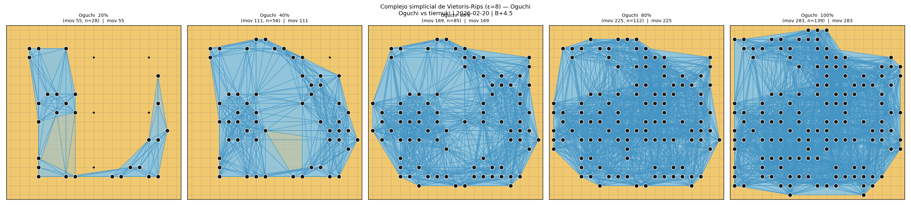 | 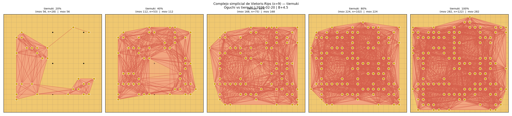 |

#### Filtración de Vietoris-Rips (ε progresivo)

| Negro | Blanco |
|:-:|:-:|
| 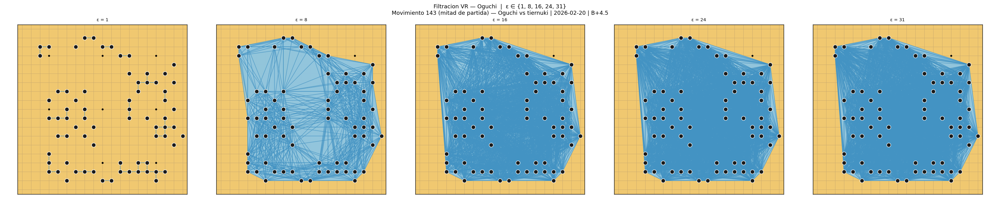 | 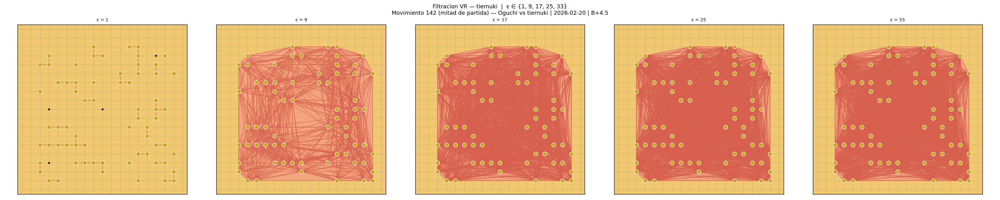 |

#### Evolución de la entropía persistente

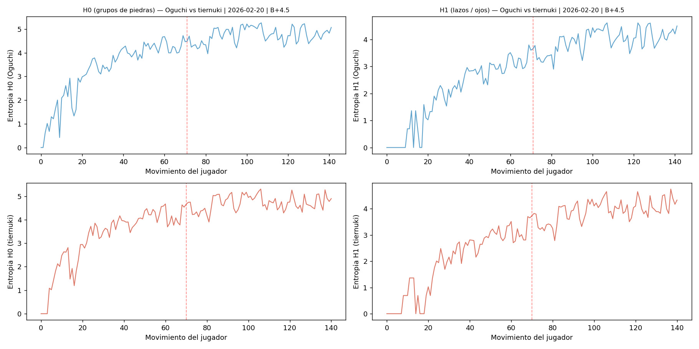

#### Curvas de Betti comparadas


Las curvas de Betti de ambos jugadores se solapan casi perfectamente — confirmación visual de la convergencia topológica.

#### Cohomología: ¿quién tiene el territorio más sólido?

| Negro (Oguchi) | Blanco (tiernuki) |
|:-:|:-:|
| 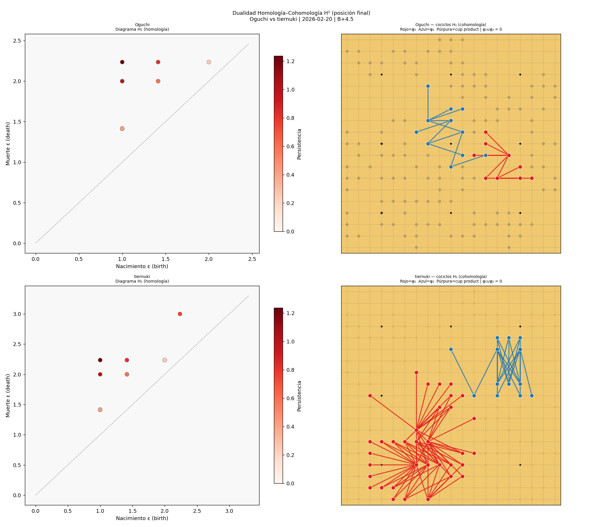 | |

tiernuki construyó el lazo H₁ más persistente (3.00 vs 1.16 de Oguchi) — coherente con su victoria por B+4.5.

#### Espacio topológico del jugador (UMAP + MDS)

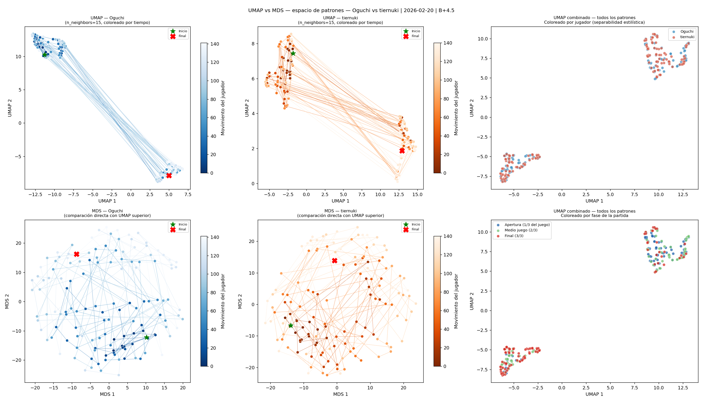

#### Nuevos descriptores: ECC, Silhouette, transiciones

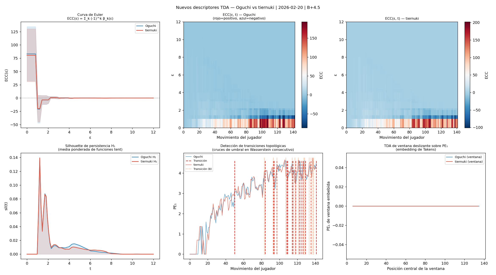

#### Resultados estadísticos

| Pregunta | p-valor | Conclusión |
|---|---|---|
| ¿Son topológicamente distintos Oguchi y tiernuki? | **0.908** | No — estilos casi idénticos |
| ¿Cambia el estilo de Oguchi entre apertura y final? | **0.001** | Sí — muy significativo |
| ¿Cambia el estilo de tiernuki entre apertura y final? | **0.001** | Sí — muy significativo |
| SVM apertura vs final — Oguchi (H₁) | — | **97.2% accuracy** |
| SVM apertura vs final — tiernuki (H₁) | — | **96.5% accuracy** |

Ver el [reporte generado automáticamente](ejemplo_oguchi_vs_tiernuki/reporte_oguchi_vs_tiernuki.md) o la [interpretación exhaustiva](ejemplo_oguchi_vs_tiernuki/INTERPRETACION.md).

---

## ometitlan vs haya371203 — mayor variedad topológica entre jugadores

**OGS · 2021-03-27 · 198 movimientos · B+T**
Resultados completos: [`ejemplo_ometitlan/`](ejemplo_ometitlan/)

El test de permutación arroja **p = 0.541** — mayor variedad entre jugadores que en el caso anterior, aunque sin alcanzar significancia estadística.

| Descriptor | ometitlan (N) | haya371203 (B) |
|---|---|---|
| H₀ entropía media | 3.820 | 3.787 |
| H₁ entropía media | 2.678 | 2.660 |

#### Complejos simpliciales en 5 momentos del partido

| Negro (ometitlan) | Blanco (haya371203) |
|:-:|:-:|
| 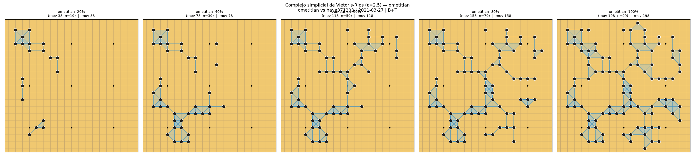 | 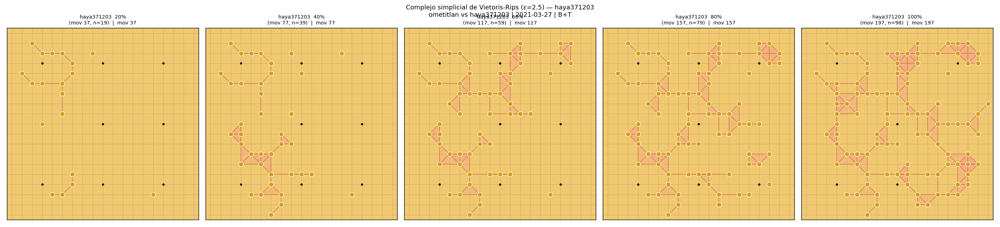 |

#### Filtración de Vietoris-Rips (a cuatro escalas ε)

| Negro | Blanco |
|:-:|:-:|
| 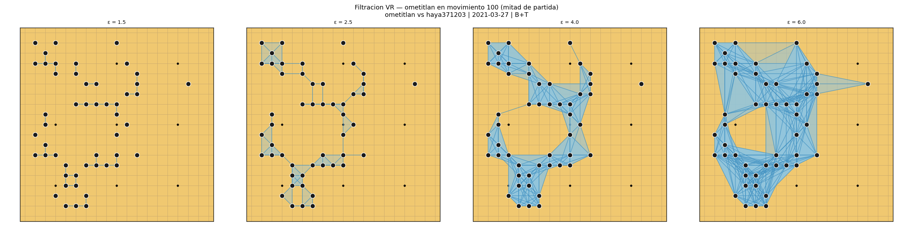 | 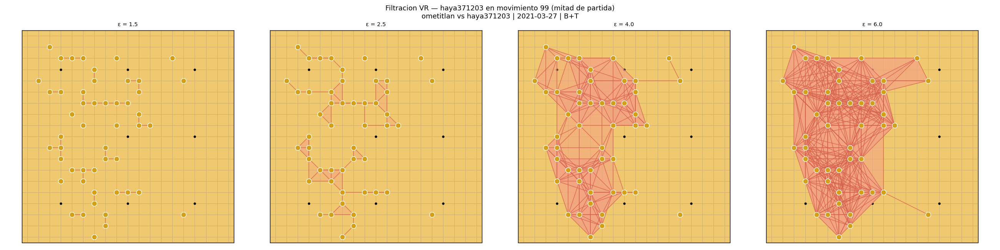 |

#### Espacio topológico MDS (Candela)

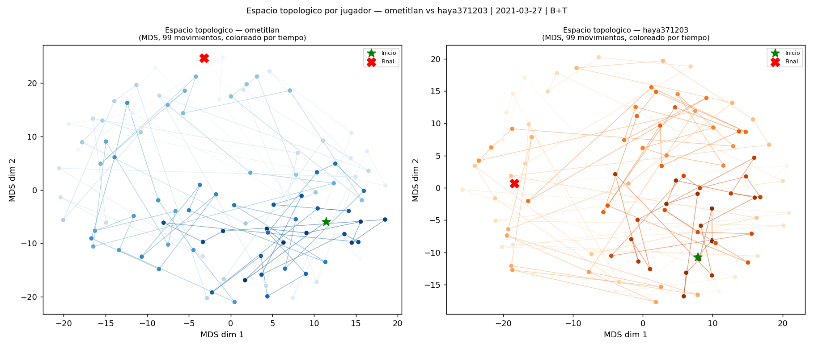

#### Evolución de la entropía

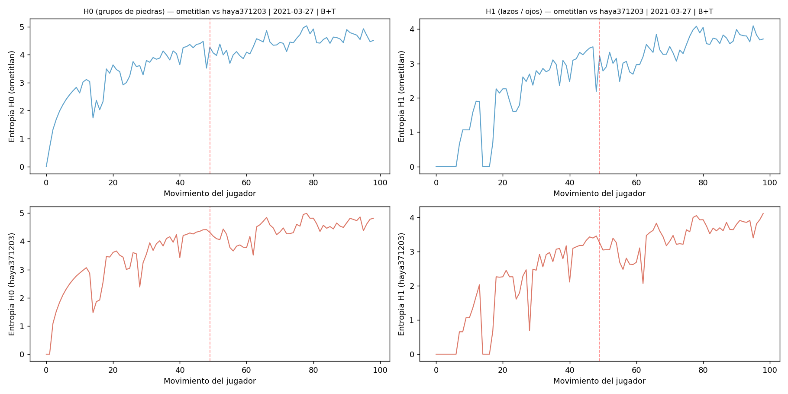

#### Curvas de Betti comparadas

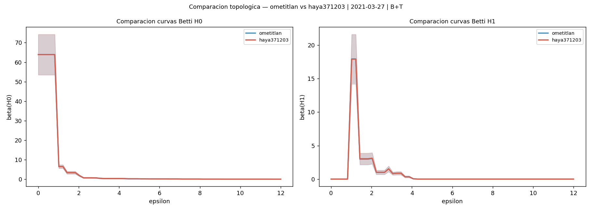

#### Resultados estadísticos

| Pregunta | p-valor | Conclusión |
|---|---|---|
| ¿Son topológicamente distintos ometitlan y haya371203? | **0.541** | No significativo, pero mayor variedad que en Oguchi vs tiernuki |
| ¿Cambia el estilo de ometitlan entre apertura y final? | 0.001 | Sí — muy significativo |
| ¿Cambia el estilo de haya371203 entre apertura y final? | 0.001 | Sí — muy significativo |
| SVM apertura vs final — ometitlan (H₁) | — | **94.9% accuracy** |
| SVM apertura vs final — haya371203 (H₁) | — | **90.9% accuracy** |

Ver el [reporte completo](ejemplo_ometitlan/reporte_ometitlan.md).

---

## Comparación directa

| Métrica | Oguchi vs tiernuki | ometitlan vs haya371203 |
|---|:-:|:-:|
| Movimientos | 283 | 198 |
| p-valor N vs B | **0.908** | **0.541** |
| Interpretación | Estilos casi idénticos | Mayor variedad entre jugadores |
| H₁ entropía media (N) | 2.978 | 2.678 |
| H₁ entropía media (B) | 2.954 | 2.660 |
| SVM apertura vs final (N) | 97.2% | 94.9% |
| SVM apertura vs final (B) | 96.5% | 90.9% |

**Lectura del p-valor entre jugadores:** un p-valor más alto (0.908) significa que los patrones de ambos jugadores son más intercambiables — estilos topológicamente convergentes. Un p-valor más bajo (0.541) indica mayor estructura diferenciada entre los dos estilos.

**Lectura del SVM apertura vs final:** una accuracy alta (≥95%) significa que los patrones topológicos de apertura y final son tan distintos que el clasificador los separa casi sin error. Una accuracy más baja indica que la transición entre fases es más gradual.

---

## Cómo correr tu propio análisis

### 1. Clonar Candela

```bash
git clone https://github.com/angelsesma/candela.git
```

### 2. Instalar dependencias

```bash
pip install -r requirements.txt
```

### 3. Correr el análisis

```bash
python analyze_game.py ruta/a/partida.sgf ruta/salida/
```

### 4. Qué produce

```
outputs/mi_partida/
├── report.md                              # Reporte automático con interpretaciones
├── analysis.json                          # Metadatos y parámetros
├── 01_complejo_vr/                        # Complejos VR en 5 momentos + filtración + dim/birth
├── 02_homologia_persistente/              # Entropía, Betti, bootstrap, diagramas
├── 03_cohomologia/                        # Dualidad H/CoH, cociclos, cup product
├── 04_espacio_topologico/                 # MDS, UMAP, VR sobre el espacio, 3D
├── 05_estadistica/                        # Matrices de distancias, tests, heatmaps
├── 06_video/
│   └── evolucion_vr.mp4                  # Video de evolución del complejo (1 frame/movimiento)
├── 07_nuevos_descriptores/               # ECC, silhouette, transiciones, test estratificado
└── distancias/
    └── *.npy                             # Matrices de distancias (bottleneck, Euclidiana)
```

Instalar `kmapper` para el grafo Mapper (opcional):

```bash
pip install kmapper
```

---

## Dependencias

```
sgfmill          # Leer archivos SGF
gudhi >= 3.9     # Homología persistente, complejo de Vietoris-Rips
persim >= 0.3    # Imágenes de persistencia
ripser >= 0.6    # Homología persistente rápida
POT >= 0.9       # Distancia de Wasserstein
scikit-learn     # SVM, MDS
scipy            # Estadística
networkx         # Grafos
numpy
matplotlib
```

```bash
pip install -r requirements.txt
```

---

## Créditos

### Candela
**[Candela](https://github.com/angelsesma/candela)** fue desarrollado por [@angelsesma](https://github.com/angelsesma). Es el componente que convierte cada posición del tablero en un patrón comparable entre jugadores, partidas y estilos de juego.

> Sesma González, Á. A., & Jiménez Martínez, L. (2025). Pattern Acquisition and Comparative Analysis in the Game of Go: A Modern Approach. *Journal of Go Studies*, 2. https://intergostudies.net/journal/journal_view.asp?jn_num=9

### Análisis topológico y desarrollo del proyecto

**Autor:** Leonardo Jiménez Martínez  
**Centro de investigación:** BIOMAT Centro de Biomatemáticas

La capa TDA (`candela_tda/`) fue construida sobre Candela por [@metamatematico](https://github.com/metamatematico) usando [GUDHI](https://gudhi.inria.fr/), [persim](https://persim.scikit-tda.org/) y Fasy et al. (2014) para las bandas de confianza bootstrap.

> Jiménez Martínez, L. & Sesma González, Á. A. (2026). Un análisis topológico del Baduk: Homología persistente y reconocimiento canónico de patrones aplicados al juego de Go. [docs/Analisis_Topologico_del_Baduk.pdf](docs/Analisis_Topologico_del_Baduk.pdf)
