# Analisis TDA por Jugador — Oguchi vs tiernuki (2026-02-20)

**Generado:** 2026-04-30 14:59:16

---

## Configuracion

```json
{
  "sgf": "84385826-285-tiernuki-Oguchi.sgf",
  "negro": "Oguchi",
  "blanco": "tiernuki",
  "resultado": "B+4.5",
  "fecha": "2026-02-20",
  "komi": 6.5,
  "fuente": "OGS: https://online-go.com/game/84385826",
  "max_edge_length": 12.0,
  "max_dimension": 2,
  "epsilon_figuras_negro": 8,
  "epsilon_figuras_blanco": 9,
  "epsilons_negro": [
    1,
    8,
    16,
    24,
    31
  ],
  "epsilons_blanco": [
    1,
    9,
    17,
    25,
    33
  ],
  "bootstrap_resamples": 400,
  "n_permutaciones": 999,
  "seed": 0
}
```

---

## Resumen de la cohorte

| Parametro | Valor |
|-----------|-------|
| movimientos_totales | 283 |
| patrones_unicos | 281 |
| movimientos_Oguchi | 142 |
| movimientos_tiernuki | 141 |

---

## Descriptores topologicos

### H0 — OGUCHI (GRUPOS DE PIEDRAS)

| Descriptor | Valor |
|------------|-------|
| mean | 3.9978 |
| std | 1.1666 |
| min | 0.0000 |
| max | 5.2623 |
| betti0_en_eps6 | 0.1056 |

### H1 — OGUCHI (LAZOS / OJOS)

| Descriptor | Valor |
|------------|-------|
| mean | 2.9778 |
| std | 1.3238 |
| min | 0.0000 |
| max | 4.6142 |
| betti1_en_eps6 | 0.0423 |

### H0 — TIERNUKI (GRUPOS DE PIEDRAS)

| Descriptor | Valor |
|------------|-------|
| mean | 3.9724 |
| std | 1.1571 |
| min | 0.0000 |
| max | 5.3053 |
| betti0_en_eps6 | 0.0780 |

### H1 — TIERNUKI (LAZOS / OJOS)

| Descriptor | Valor |
|------------|-------|
| mean | 2.9541 |
| std | 1.3125 |
| min | -0.0000 |
| max | 4.7491 |
| betti1_en_eps6 | 0.0638 |

---

## Resultados estadisticos

### Test de permutacion — Oguchi vs tiernuki (estilo topologico)

| Estadistico T | -0.0492 |
|---------------|------|
| p-valor | 0.9080 |
| Permutaciones | 999 |

El test de permutacion (Oguchi vs tiernuki (estilo topologico)) no es significativo (p = 0.908 (no significativo)). No hay evidencia suficiente para rechazar que ambas cohortes provienen de la misma distribucion topologica.

### Test de permutacion — Apertura vs Final (toda la partida)

| Estadistico T | 2.0054 |
|---------------|------|
| p-valor | 0.0010 |
| Permutaciones | 999 |

El test de permutacion (Apertura vs Final (toda la partida)) resulta **p = 0.001** (significativo). El estadistico T=2.0054 indica que la distancia media entre los dos grupos es mayor que la esperada bajo la hipotesis nula. Esto significa que las dos cohortes de patrones tienen distribuciones topologicas **estadisticamente diferentes**.

### Test de permutacion — Apertura vs Final — solo Oguchi

| Estadistico T | 2.3280 |
|---------------|------|
| p-valor | 0.0010 |
| Permutaciones | 999 |

El test de permutacion (Apertura vs Final — solo Oguchi) resulta **p = 0.001** (significativo). El estadistico T=2.3280 indica que la distancia media entre los dos grupos es mayor que la esperada bajo la hipotesis nula. Esto significa que las dos cohortes de patrones tienen distribuciones topologicas **estadisticamente diferentes**.

### Test de permutacion — Apertura vs Final — solo tiernuki

| Estadistico T | 1.6257 |
|---------------|------|
| p-valor | 0.0010 |
| Permutaciones | 999 |

El test de permutacion (Apertura vs Final — solo tiernuki) resulta **p = 0.001** (significativo). El estadistico T=1.6257 indica que la distancia media entre los dos grupos es mayor que la esperada bajo la hipotesis nula. Esto significa que las dos cohortes de patrones tienen distribuciones topologicas **estadisticamente diferentes**.

### Clustering aglomerativo (k=2)

| Silhouette | 0.3012 |
|------------|------|
| Coef. Cofenotico | 0.8716 |

El coeficiente de silueta (0.301) indica estructura debil pero existente con k=2 clusters. El coeficiente cofenotico (0.872) es muy buena: el dendrograma representa fielmente las distancias originales. Los clusters son difusos; interpretar con cautela.

### Bandas de confianza bootstrap (Fasy et al. 2014)

| Valor critico c_alpha | 0.2510 |
|------------------------|------|
| Nivel de significancia | 95% |

La curva de Betti media cae dentro de una banda de confianza del 95% con valor critico c_alpha=0.251. Un c_alpha bajo indica poca variabilidad entre los diagramas de la cohorte; uno alto indica diversidad topologica elevada.

### Clasificador SVM — H0 — Oguchi vs tiernuki

| Accuracy media | 0.5018 +/- 0.0100 |
|----------------|------|
| F1 macro | 0.3341 |

El clasificador SVM (H0 — Oguchi vs tiernuki) obtiene una accuracy de 0.502 +/- 0.010, comparable al azar (referencia azar ~0.50). El F1 macro de 0.334 es bajo, lo que sugiere que las imagenes de persistencia H0 no codifican suficiente informacion discriminante para esta tarea.

### Clasificador SVM — H1 — Oguchi vs tiernuki

| Accuracy media | 0.4313 +/- 0.0100 |
|----------------|------|
| F1 macro | 0.4176 |

El clasificador SVM (H1 — Oguchi vs tiernuki) obtiene una accuracy de 0.431 +/- 0.010, comparable al azar (referencia azar ~0.50). El F1 macro de 0.418 es bajo, lo que sugiere que las imagenes de persistencia H0 no codifican suficiente informacion discriminante para esta tarea.

### Clasificador SVM — H1 — Apertura vs Final (Oguchi)

| Accuracy media | 0.9716 +/- 0.0100 |
|----------------|------|
| F1 macro | 0.9716 |

El clasificador SVM (H1 — Apertura vs Final (Oguchi)) obtiene una accuracy de 0.972 +/- 0.010, claramente mejor que el azar (referencia azar ~0.50). El F1 macro de 0.972 indica que el clasificador discrimina entre clases de forma equilibrada.

### Clasificador SVM — H1 — Apertura vs Final (tiernuki)

| Accuracy media | 0.9645 +/- 0.0100 |
|----------------|------|
| F1 macro | 0.9644 |

El clasificador SVM (H1 — Apertura vs Final (tiernuki)) obtiene una accuracy de 0.965 +/- 0.010, claramente mejor que el azar (referencia azar ~0.50). El F1 macro de 0.964 indica que el clasificador discrimina entre clases de forma equilibrada.

---

## Figuras

### 01 Negro Momentos


**Interpretacion:** Complejo simplicial de Vietoris-Rips (ε=8) construido sobre las piedras acumuladas de Oguchi en cinco momentos de la partida (20%, 40%, 60%, 80%, 100%). ε=8 es el segundo valor del intervalo discreto adaptado a esta partida (ε ∈ {1, 8, 16, 24, 31}), equivalente al ~20%% del rango total. A esta escala se capturan conexiones tacticas locales: piedras adyacentes y a salto de un espacio. Los triangulos (2-simplices) son trios de piedras mutuamente proximas. La creciente densidad de triangulos hacia el final refleja la consolidacion de territorios.

### 02 Blanco Momentos


**Interpretacion:** Idem para tiernuki con ε=9 (intervalo ε ∈ {1, 9, 17, 25, 33}). Comparar la estructura del complejo con la de Oguchi permite ver diferencias en como cada jugador ocupa el tablero: grupos mas dispersos vs mas concentrados, mayor o menor numero de 2-simplices.

### 03 Negro Filtracion Epsilon


**Interpretacion:** Filtracion de Vietoris-Rips de las piedras de Oguchi en el movimiento 143 (mitad de partida) con intervalo discreto de epsilon adaptado a esta partida: ε ∈ {1, 8, 16, 24, 31}. La cota superior (ε=31) es la distancia Manhattan maxima entre dos piedras de Oguchi en la posicion final — el mayor alcance que tiene sentido medir para este jugador en este juego especifico. A ε=1 solo se conectan piedras adyacentes (grupos del tablero de Go). A ε=31 el complejo captura todas las relaciones de largo alcance posibles entre las piedras de Oguchi. Esta progresion es la visualizacion directa de la filtracion que usa la homologia persistente.

### 04 Blanco Filtracion Epsilon


**Interpretacion:** Idem para tiernuki en su movimiento 142. Intervalo adaptado: ε ∈ {1, 9, 17, 25, 33}. La cota superior ε=33 es la distancia Manhattan maxima entre dos piedras de tiernuki en la posicion final de esta partida.

### 05 Negro Dim Birth

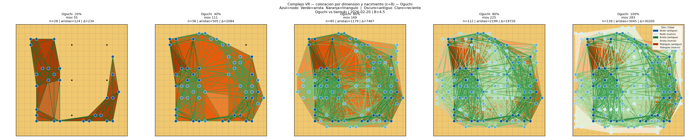

**Interpretacion:** Complejo VR de Oguchi con coloracion por dimension y momento de nacimiento (ε=8). Cada simbolo mantiene su color en todos los paneles posteriores, permitiendo rastrear la historia de cada estructura topologica. AZUL (familia Blues): nodos (0-simplices) = piedras del tablero. VERDE (familia Greens): aristas (1-simplices) = conexiones entre piedras dentro de ε. NARANJA (familia Oranges): triangulos (2-simplices) = trios de piedras mutuamente proximas. INTENSIDAD: oscuro = nacido en momentos tempranos de la partida (estructura establecida); claro = nacido recientemente (estructura nueva). Un triangulo naranja oscuro que aparece ya al 40%% y persiste hasta el 100%% indica un nucleo territorial que se establecio temprano y se mantuvo estable. Una arista verde clara que solo aparece al 100%% es una conexion recien formada.

### 06 Blanco Dim Birth

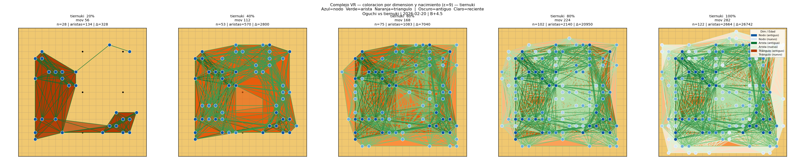

**Interpretacion:** Idem para tiernuki con ε=9. Comparar con la figura de Oguchi permite ver si los dos jugadores construyen sus estructuras topologicas en momentos distintos de la partida — por ejemplo, si uno consolida territorio (triangulos naranjas oscuros) antes que el otro.

### 01 Entropia


**Interpretacion:** Evolucion de la entropia persistente H0 (grupos de piedras) y H1 (lazos/ojos) para cada jugador a lo largo de sus propios movimientos. La linea roja vertical marca la mitad de los movimientos de ese jugador. Una H0 creciente refleja como el jugador va poblando el tablero con grupos cada vez mas variados. Un pico de H1 indica el momento de maxima complejidad territorial (ojos, cercados). Comparar ambas filas permite ver si los dos jugadores tienen ritmos de complejizacion distintos.

### 02 Betti Bootstrap

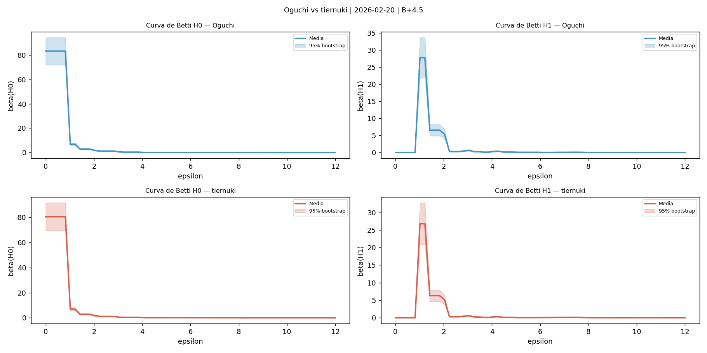

**Interpretacion:** Curvas de Betti con bandas de confianza al 95% (Fasy et al. 2014) calculadas sobre los patrones de cada jugador por separado. La banda sombreada indica la variabilidad entre movimientos: una banda estrecha significa que el jugador juega patrones topologicamente consistentes; una banda ancha, que hay alta variabilidad estilistica. La comparacion directa de las curvas de Oguchi y tiernuki en 03_comparacion_betti muestra si sus estilos topologicos difieren sistematicamente.

### 03 Comparacion Betti


**Interpretacion:** Superposicion de las curvas de Betti de Oguchi y tiernuki en las mismas axes, con sus respectivas bandas de confianza al 95%. Si las curvas se solapan, los dos jugadores tienen estilos topologicos similares a esa escala. Si se separan, hay diferencias sistematicas: uno forma mas grupos (H0 mas alto) o mas lazos/ojos (H1 mas alto) que el otro.

### 04 Diagramas Persistencia

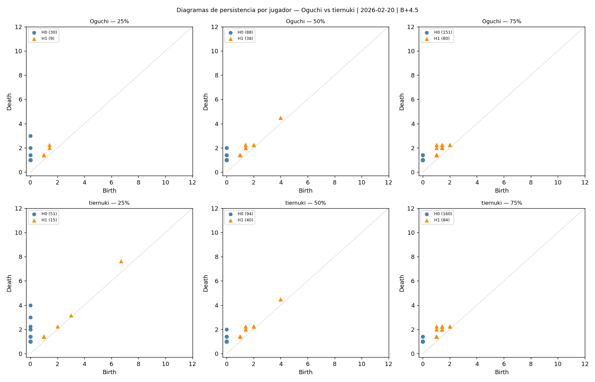

**Interpretacion:** Diagramas de persistencia de cada jugador en tres momentos (25%, 50%, 75%). Puntos azules: componentes conexos (H0). Triangulos naranjas: lazos (H1). Puntos lejos de la diagonal son caracteristicas topologicas significativas y duraderas. La evolucion de los diagramas muestra como cambia la complejidad topologica de los patrones de cada jugador a medida que avanza la partida.

### 01 Dualidad Homologia Cohomologia


**Interpretacion:** Dualidad homologia-cohomologia H1 en la posicion final de cada jugador. Panel izquierdo: diagrama de persistencia H1 (vista homologica) — cada punto (birth, death) representa un loop que existe entre esas dos escalas; los puntos lejos de la diagonal son los features topologicos mas significativos. Panel derecho: los dos cociclos H1 mas persistentes dibujados sobre el tablero (rojo=phi1, azul=phi2) y los triangulos purpura donde su cup product es no cero. La homologia dice QUE loops existen; la cohomologia dice QUE pares de piedras los sostienen; el cup product phi1 union phi2 detecta si dos loops interactuan formando una clase H2 — la firma algebraica de un grupo con dos ojos.

**Interpretacion especifica de esta partida:**

**Oguchi — vista homológica (¿QUÉ loops existen?):** El diagrama H₁ muestra un lazo debilmente persistente — lazo frágil, posiblemente transitorio. Nace a ε=2.00 (las piedras que lo forman quedan conectadas a esa escala) y muere a ε=3.16 (el loop se cierra en un complejo mayor). Persistencia=1.16. Existe un segundo lazo H₁ (birth=2.00, death=3.16, persist=1.16) — dos estructuras de loop distinguibles.
**Oguchi — vista cohomológica (¿QUÉ pares de piedras lo sostienen?):** El cociclo φ₁ (rojo en Fig. 14) es una función en las aristas que evalúa a 1 exactamente sobre los 10 pares de piedras que forman la 'columna vertebral' del loop. Esta es la dualización algebraica: donde la homología dice 'existe un agujero', la cohomología dice 'estas conexiones específicas lo sostienen'.
**Oguchi — cup product φ₁∪φ₂ = 0:** Los dos lazos H₁ no interactúan en ningún 2-símplex — sus territorios son independientes. No hay evidencia topológica de un grupo con dos ojos en la posición final.

**tiernuki — vista homológica (¿QUÉ loops existen?):** El diagrama H₁ muestra un lazo muy persistente — territorio firmemente establecido. Nace a ε=2.00 (las piedras que lo forman quedan conectadas a esa escala) y muere a ε=5.00 (el loop se cierra en un complejo mayor). Persistencia=3.00. Existe un segundo lazo H₁ (birth=3.00, death=4.47, persist=1.47) — dos estructuras de loop distinguibles.
**tiernuki — vista cohomológica (¿QUÉ pares de piedras lo sostienen?):** El cociclo φ₁ (rojo en Fig. 14) es una función en las aristas que evalúa a 1 exactamente sobre los 69 pares de piedras que forman la 'columna vertebral' del loop. Esta es la dualización algebraica: donde la homología dice 'existe un agujero', la cohomología dice 'estas conexiones específicas lo sostienen'.
**tiernuki — cup product φ₁∪φ₂ = 0:** Los dos lazos H₁ no interactúan en ningún 2-símplex — sus territorios son independientes. No hay evidencia topológica de un grupo con dos ojos en la posición final.

**Comparacion:** ningún jugador tiene cup product no trivial en la posición final. tiernuki tiene el lazo H₁ más persistente (3.00 vs 1.16), indicando mayor solidez territorial aunque sin dos ojos algebraicamente confirmados.

### 02 Cociclos Por Momento

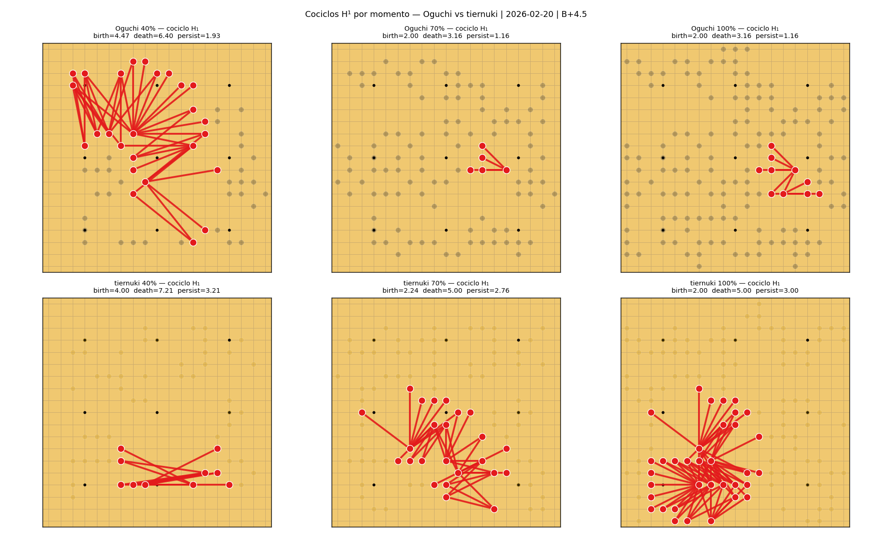

**Interpretacion:** Cociclo H1 mas persistente de cada jugador en tres momentos (40%, 70%, 100%). Las aristas rojas son los pares de piedras que forman el 1-cociclo representativo del lazo topologico mas duradero en ese momento. Permite ver como evoluciona la estructura cohomologica a lo largo de la partida: si el cociclo crece, el territorio se consolida; si cambia de forma brusca, hubo una ruptura o captura que reorganizo la topologia del jugador.

### 01 Mds Trayectoria

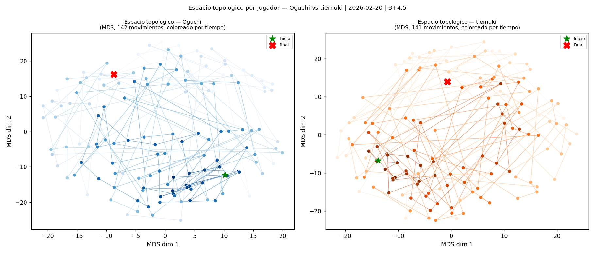

**Interpretacion:** Espacio topologico de cada jugador: cada punto es uno de sus movimientos, representado por su vector de caracteristicas de 361 dimensiones y proyectado en 2D mediante MDS (Multidimensional Scaling). Los puntos estan coloreados de oscuro (inicio) a claro (final). La linea traza la trayectoria temporal. Una trayectoria compacta indica un jugador consistente; una dispersa indica alta variedad de patrones. La estrella verde es el primer movimiento; la X roja es el ultimo.

### 02 Vr Sobre Mds

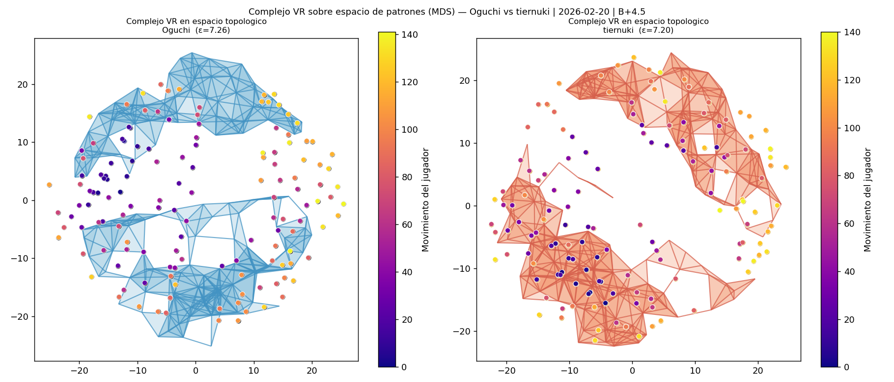

**Interpretacion:** Complejo simplicial de Vietoris-Rips construido directamente sobre el espacio topologico MDS de cada jugador. El epsilon se ajusta automaticamente al percentil 20 de las distancias inter-patron en el espacio MDS. Los triangulos (2-simplices) indican grupos de movimientos topologicamente similares. Los colores de los nodos representan el tiempo (plasma: oscuro=inicio, claro=final). Este es el espacio topologico global del jugador a lo largo de toda la partida.

### 03 Umap Vs Mds


**Interpretacion:** Comparacion directa entre UMAP (fila superior) y MDS (fila inferior) como metodos de reduccion de dimensionalidad del espacio de patrones. MDS (Multidimensional Scaling) es un metodo lineal que preserva distancias globales pero puede comprimir clusters locales. UMAP (Uniform Manifold Approximation and Projection) combina teoria de grafos y topologia algebraica para construir un grafo kNN pesado sobre el espacio de datos y luego optimiza un embebimiento 2D que preserva tanto la estructura local (clusters) como la global (relaciones entre grupos de patrones). Columnas 1-2: trayectoria temporal de cada jugador (oscuro=inicio, claro=final). Columna 3 fila superior: UMAP de TODOS los patrones coloreado por jugador — si los puntos de Oguchi y tiernuki forman clusters separados, sus estilos ocupan regiones distintas del espacio de patrones. Columna 3 fila inferior: UMAP coloreado por fase (azul=apertura, verde=medio juego, rojo=final) — revela si la partida tiene una estructura de manifold con fases topologicamente diferenciadas.

### 04 Umap Persistencia

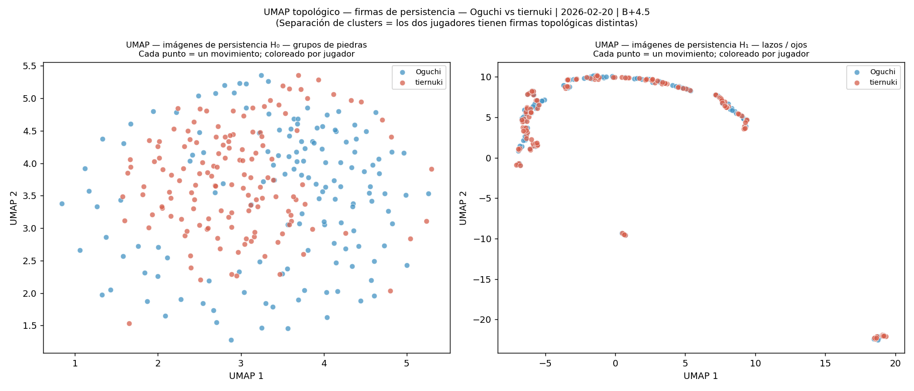

**Interpretacion:** UMAP aplicado directamente sobre las imagenes de persistencia H0 y H1 (no sobre los patrones brutos, sino sobre las firmas topologicas de cada movimiento). Cada punto es un movimiento; el color indica el jugador. Si los puntos de Oguchi y tiernuki forman clusters separados, significa que sus FIRMAS TOPOLOGICAS (no solo sus patrones de piedras) son distinguibles — el SVM (Fig. 12) detecta esta separacion con un hiperplano lineal, pero UMAP la hace visible como geometria del manifold. Una superposicion total indicaria que ambos jugadores construyen posiciones con la misma estructura topologica de grupos y lazos, independientemente de donde pongan las piedras.

### 05 Complejo 3D

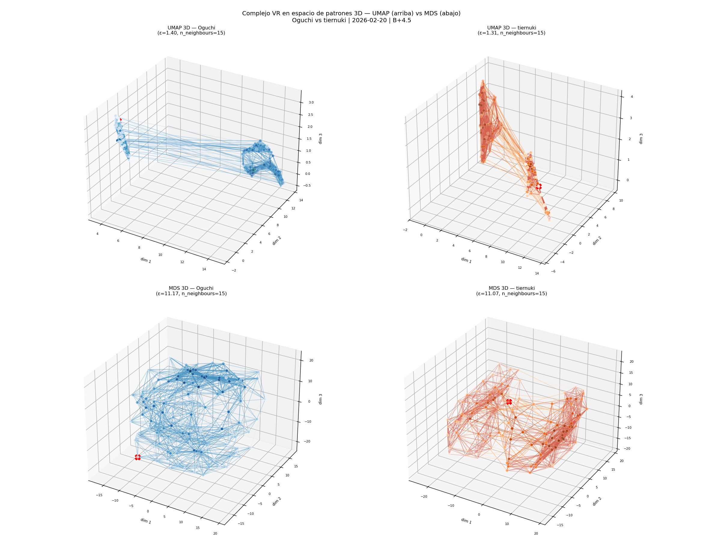

**Interpretacion:** Complejo de Vietoris-Rips construido sobre el espacio de patrones en 3 dimensiones. Fila superior: UMAP 3D (preserva estructura local y global del manifold). Fila inferior: MDS 3D (metodo lineal, referencia de comparacion). Cada punto es un movimiento del jugador; el color va de oscuro (inicio) a claro (final). La trayectoria conecta jugadas consecutivas mostrando la evolucion temporal del estilo. Las aristas del complejo VR conectan movimientos topologicamente similares a la escala epsilon elegida (percentil 25 de las distancias en el espacio embebido). La tercera dimension revela estructuras topologicas que la proyeccion 2D aplana: un lazo visible en 3D pero no en 2D indica que el espacio de patrones tiene geometria de anillo; una 'burbuja' indicaria una variedad esferica. Comparar UMAP y MDS permite verificar si la estructura 3D es robusta o un artefacto del metodo de reduccion.

### 01 Matrices Distancias

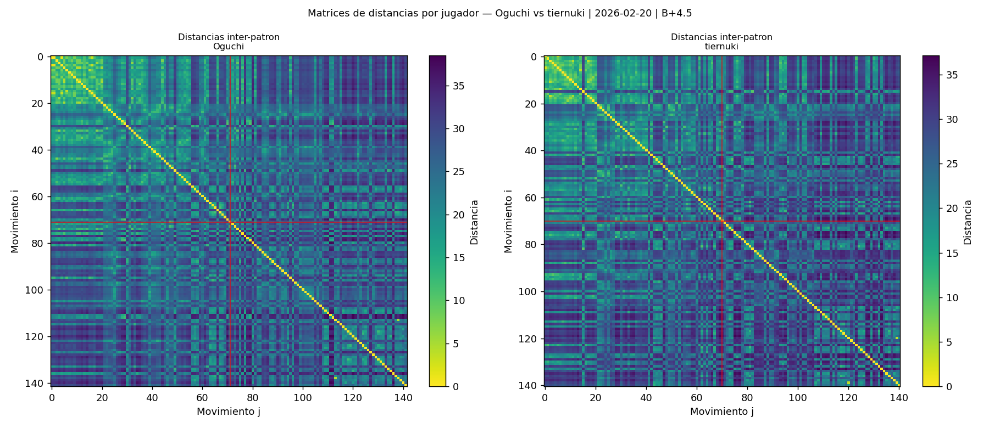

**Interpretacion:** Matrices de distancias euclidianas entre los vectores de patron de cada jugador (calculadas solo sobre sus propios movimientos). Colores oscuros = patrones similares. La linea roja divide apertura y final del jugador. Un bloque homogeneo indica estilo consistente; un gradiente indica evolucion progresiva del estilo.

### 02 Tests Permutacion

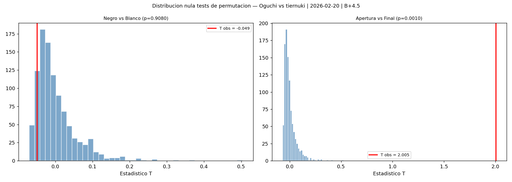

**Interpretacion:** Distribucion nula del estadistico T bajo permutacion aleatoria de etiquetas (999 permutaciones). La linea roja marca el valor observado. Izquierda: test Negro vs Blanco — si la linea roja cae en la cola derecha, los dos jugadores tienen estilos topologicos estadisticamente distintos. Derecha: test Apertura vs Final — si es significativo, la partida tiene dos fases topologicamente diferenciadas.

### 03 Heatmaps Tablero

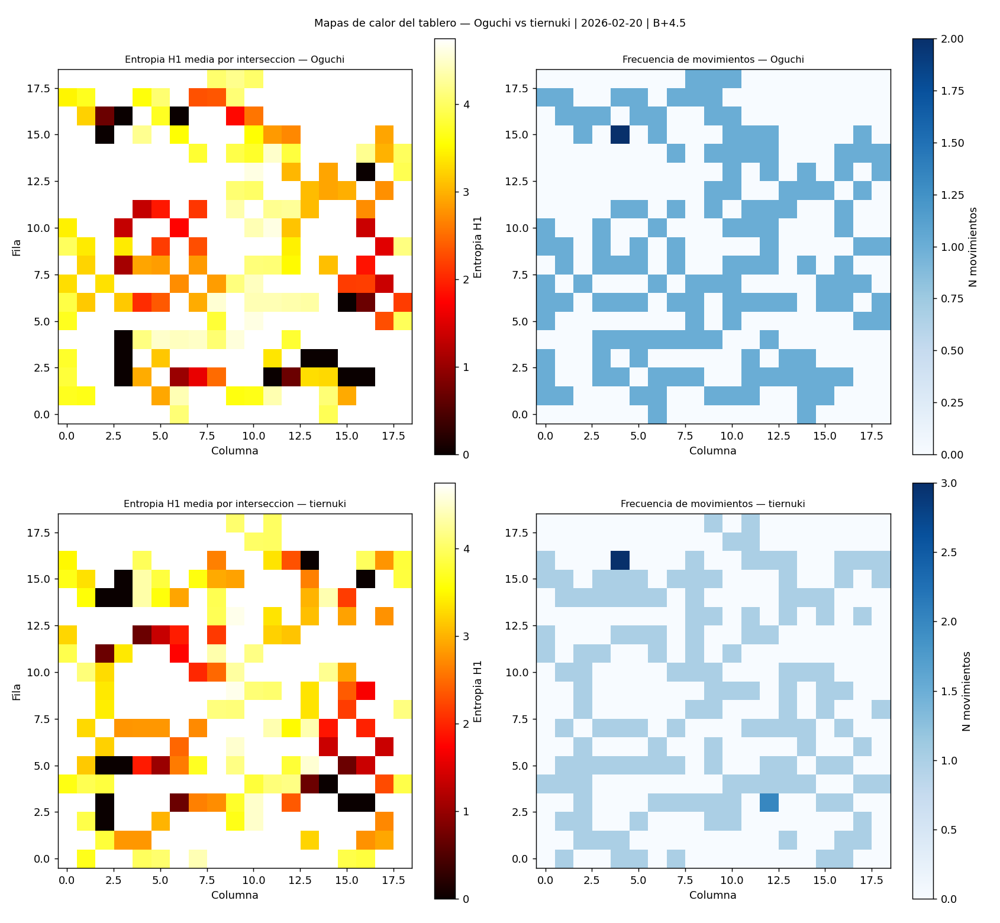

**Interpretacion:** Mapa de calor del tablero 19x19 por jugador. Izquierda: entropia H1 media en cada interseccion (rojo intenso = alta complejidad topologica en los patrones que pasan por esa interseccion). Derecha: numero de movimientos del jugador en cada interseccion. Las zonas calientes en entropia que coinciden con zonas de alta frecuencia son los puntos de mayor actividad e importancia topologica de ese jugador.

---

## Conclusiones

## Hallazgos principales

### 1. Comparacion entre jugadores
El test de permutacion Oguchi vs tiernuki arroja p=0.9080. No hay diferencia estadisticamente significativa entre los estilos topologicos de los dos jugadores. El clasificador SVM sobre imagenes de persistencia H1 obtiene 0.431 de accuracy al distinguir movimientos de Oguchi y tiernuki, lo que sugiere que la diferencia no es facilmente separable con este tipo de features.

### 2. Evolucion de cada jugador
- **Oguchi**: apertura vs final p=0.0010 (significativo). H1 entropia media=2.978.
- **tiernuki**: apertura vs final p=0.0010 (significativo). H1 entropia media=2.954.

### 3. Complejos simpliciales
La filtracion VR (Figs. 03-04) muestra como cada jugador construye su red de piedras a lo largo de la partida. La Fig. 05-06 ilustra la filtracion: a epsilon pequeno solo se conectan grupos adyacentes (refleja la logica de atari y capturas); a epsilon grande emergen relaciones de largo alcance entre grupos separados (estrategia de influencia global).

### 4. Espacio topologico del jugador
El espacio MDS (Figs. 07-08) muestra la trayectoria estilistica de cada jugador. Un espacio compacto indica consistencia; uno disperso, variedad tactica. El complejo VR sobre este espacio revela si hay clusters de movimientos similares (posibles repertorios tacticos o secuencias joseki repetidas).

### 5. Cohomologia persistente
La Fig. 14 muestra el cociclo H1 mas persistente de cada jugador en tres momentos. A diferencia de la homologia (que detecta que existe un lazo), la cohomologia identifica exactamente que pares de piedras forman la estructura de ese lazo. Las aristas rojas son los 1-cociclos representativos.

**Oguchi — vista homológica (¿QUÉ loops existen?):** El diagrama H₁ muestra un lazo debilmente persistente — lazo frágil, posiblemente transitorio. Nace a ε=2.00 (las piedras que lo forman quedan conectadas a esa escala) y muere a ε=3.16 (el loop se cierra en un complejo mayor). Persistencia=1.16. Existe un segundo lazo H₁ (birth=2.00, death=3.16, persist=1.16) — dos estructuras de loop distinguibles.
**Oguchi — vista cohomológica (¿QUÉ pares de piedras lo sostienen?):** El cociclo φ₁ (rojo en Fig. 14) es una función en las aristas que evalúa a 1 exactamente sobre los 10 pares de piedras que forman la 'columna vertebral' del loop. Esta es la dualización algebraica: donde la homología dice 'existe un agujero', la cohomología dice 'estas conexiones específicas lo sostienen'.
**Oguchi — cup product φ₁∪φ₂ = 0:** Los dos lazos H₁ no interactúan en ningún 2-símplex — sus territorios son independientes. No hay evidencia topológica de un grupo con dos ojos en la posición final.

**tiernuki — vista homológica (¿QUÉ loops existen?):** El diagrama H₁ muestra un lazo muy persistente — territorio firmemente establecido. Nace a ε=2.00 (las piedras que lo forman quedan conectadas a esa escala) y muere a ε=5.00 (el loop se cierra en un complejo mayor). Persistencia=3.00. Existe un segundo lazo H₁ (birth=3.00, death=4.47, persist=1.47) — dos estructuras de loop distinguibles.
**tiernuki — vista cohomológica (¿QUÉ pares de piedras lo sostienen?):** El cociclo φ₁ (rojo en Fig. 14) es una función en las aristas que evalúa a 1 exactamente sobre los 69 pares de piedras que forman la 'columna vertebral' del loop. Esta es la dualización algebraica: donde la homología dice 'existe un agujero', la cohomología dice 'estas conexiones específicas lo sostienen'.
**tiernuki — cup product φ₁∪φ₂ = 0:** Los dos lazos H₁ no interactúan en ningún 2-símplex — sus territorios son independientes. No hay evidencia topológica de un grupo con dos ojos en la posición final.

**Comparacion:** ningún jugador tiene cup product no trivial en la posición final. tiernuki tiene el lazo H₁ más persistente (3.00 vs 1.16), indicando mayor solidez territorial aunque sin dos ojos algebraicamente confirmados.

**Tiempo total de analisis:** 1031.9s

